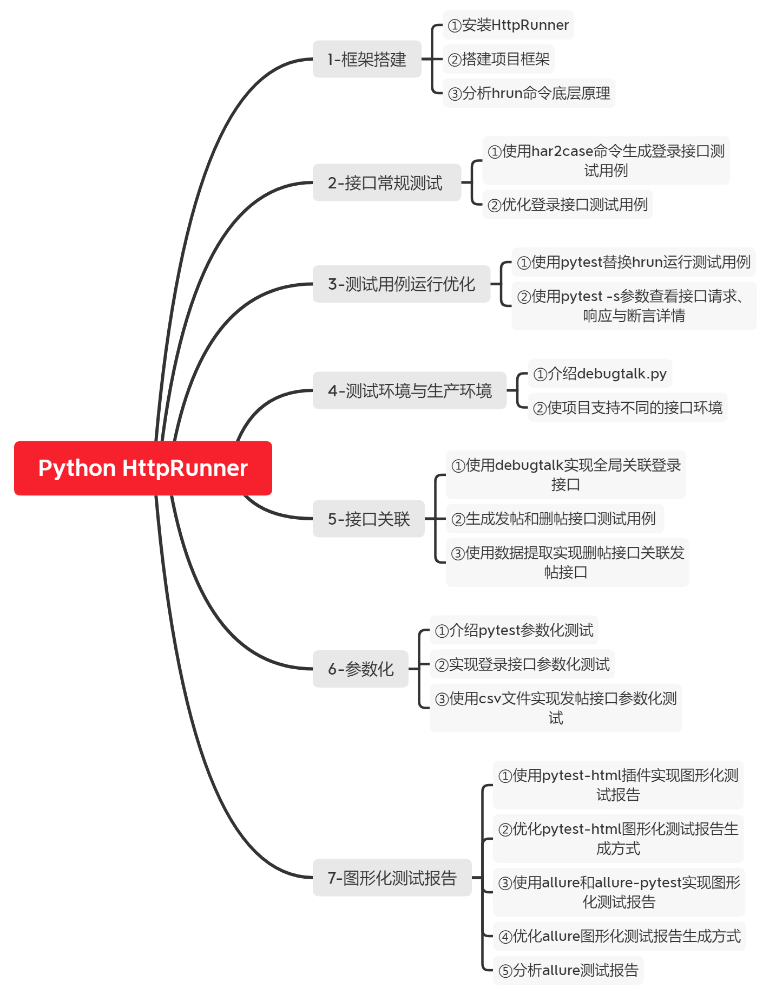
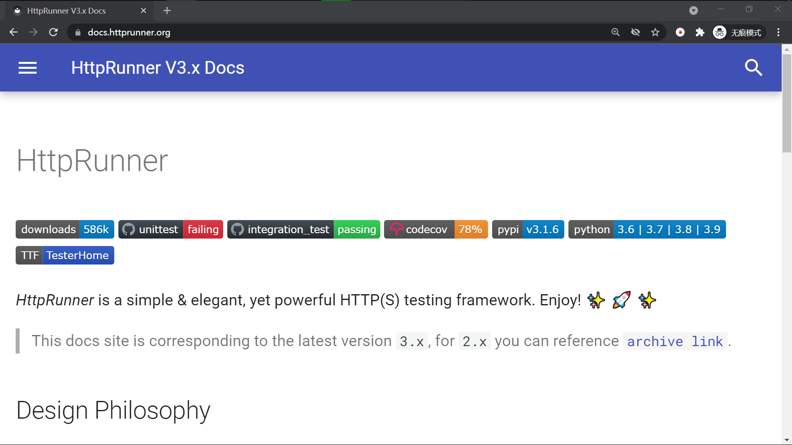
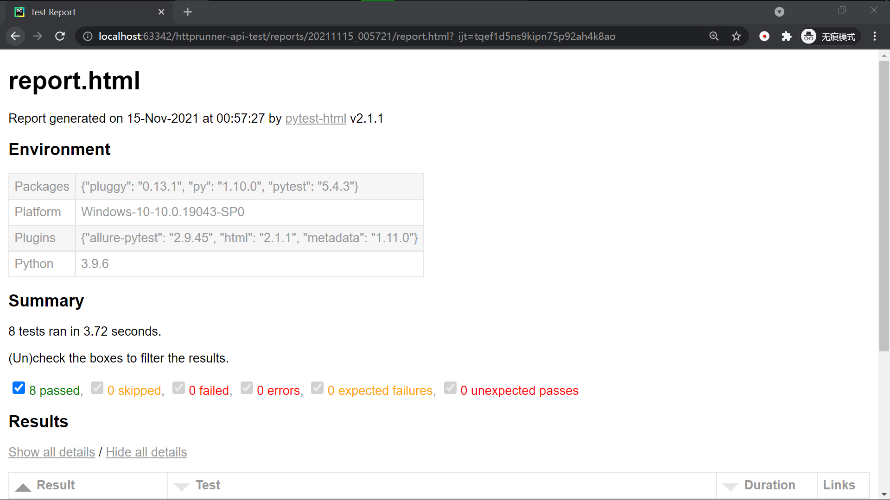
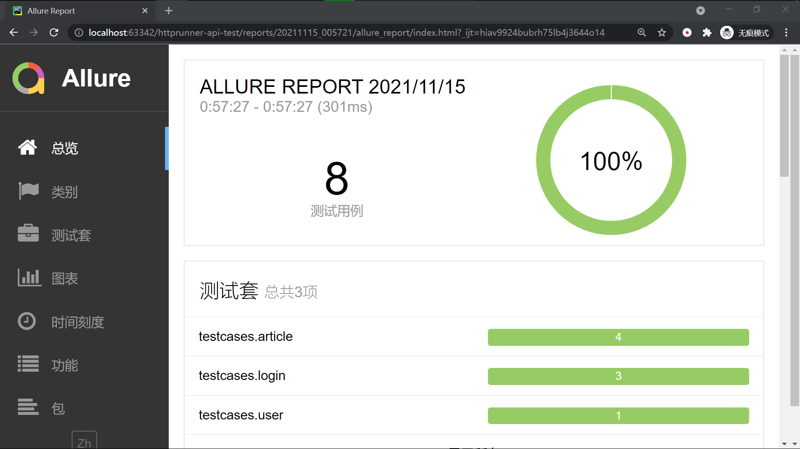

Python HttpRunner 接口自动化测试 项目实践
=======================================

课程介绍
-------

如果项目功能繁杂、迭代频繁，回归测试时间会比较少，人工进行接口回归测试，会比较耗时、容易遗漏。越来越多同学，希望能实现接口自动化测试。目前主流实现方式是Pytest+Requests，虽然非常灵活，但开发难度较大，效率不是很高。

HttpRunner底层封装了Pytest和Requests，可用接口har文件快速生成接口测试用例，有很多封装好的断言方法，支持接口关联，支持接口参数化测试，可生成pytest-html和allure图形化测试报告。相比于直接使用Pytest+Requests，HttpRunner的开发效率能显著提高，非常适用于中大型项目的接口自动化测试。

本课程以开发项目、优化项目、讲解底层原理、讲解官网文档的方式带大家一起学习HttpRunner，希望大家学习完后，能高效开发中大型项目的接口自动化测试。

课程主要内容：  

①框架搭建；  
②接口常规测试；    
③接口测试环境与生成环境；  
④接口关联；   
⑤接口参数化测试；  
⑥图形化测试报告。  

课程内容
-------

官网文档
-------

图形化测试报告
------------

